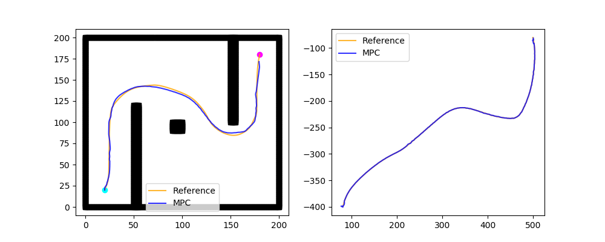
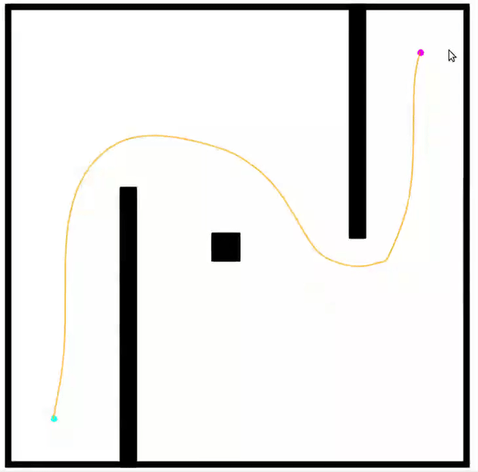
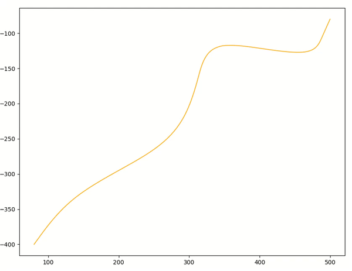

# SimpleCar-Planning
Planning and Decision Making(RO47005) course project of group 9.

**Group members**: Jianfeng Cui - 5225256, Yulei Qiu - ... 

This repository is for the planning and control of the simple car model. It is developed based on C++ using [OMPL](http://ompl.kavrakilab.org/) and [ACADO Toolkit](http://acado.github.io/). In this scenario the kinematics car plans the path with RRT star and is controlled by MPC.

## 1. Prerequisites
The library is tested on **Ubuntu 18.04**, but it should be easy to complie in other platforms.
### OMPL
We use [OMPL](http://ompl.kavrakilab.org/) to perform the planning task. Download and install instructions can be found at: http://ompl.kavrakilab.org/download.html. We recommend to install the OMPL.app from source. OMPL.app provides GUI and bindings to FCL and also includes the core OMPL library. **Tested with OMPL.app 1.5.1**

### ACADO Toolkit
For the task of control and with optimization, we use [ACADO Toolkit](http://acado.github.io/) to perform the Model Predictive Control. Instructions of building with C++ library can be found at: http://acado.github.io/install_linux.html. **Tested with ACADO 1.2.2**

## 2. Building the repository
We provide a script `build.sh` to build. Execute:
```bash
cd SimpleCar-Planning
chmod +x build.sh
./build.sh
```
This will create **libsimple_car.so** at*lib*folder and the executables **SimpleCarMain**, **MPC_simulate** and **MPC_simulate_app** at*bin*folder. 

## 3. Run the project
Two environments are used in the repository: a manually designed map using grids and imported environment file Barriers_easy_env.dae. The later one is for the use of ompl.app, and in order to make the robot compatible with the environment, a simple car model kinematics_car.dae is drawed using [SketchUp](https://app.sketchup.com/app).

In both scenarios, firstly we test an approach of OMPL to plan with control space to see what will happen if using it, and secondly do the task by first generating a reference path using geometric planners, and then tracking it using MPC under simple car constraints. So four functions are provided in total: `plan()`, `planWithApp()`, `PlanGeometric()`, `PlanGeometricWithApp()`. Execute:
```bash
cd bin
./SimpleCarMain
```
Four corresponding path file simple_car_path.txt, simple_car_path_app.txt, simple_car_path_geometric.txt, simple_car_path_geometric_app.txt will be generated in the*data*folder. The later two files will be used in MPC as the reference trajectory. Execute:
```
./MPC_simulate
./MPC_simulate_app
```
Four files will be generated at*data*folder: output_states.txt, output_states_app.txt, output_controls.txt, output_controls_app.txt

## 4. Visualize the result

Several python scripts are written to convert the data and visualize. The path generated by the first try with control space uses kinodynamic adaptations of RRT, and shows jagged polylines, thus not being discussed further. The result using the geometric reference path tracking by MPC is shown below:



The left figure shows the reference and tracking trajectory under the self-designed map, and the dynamic simulation was also written by python scripts. The right one is in the scenario with ompl.app, for which the whole visualization is simulated in the ompl GUI. They are shown below:





